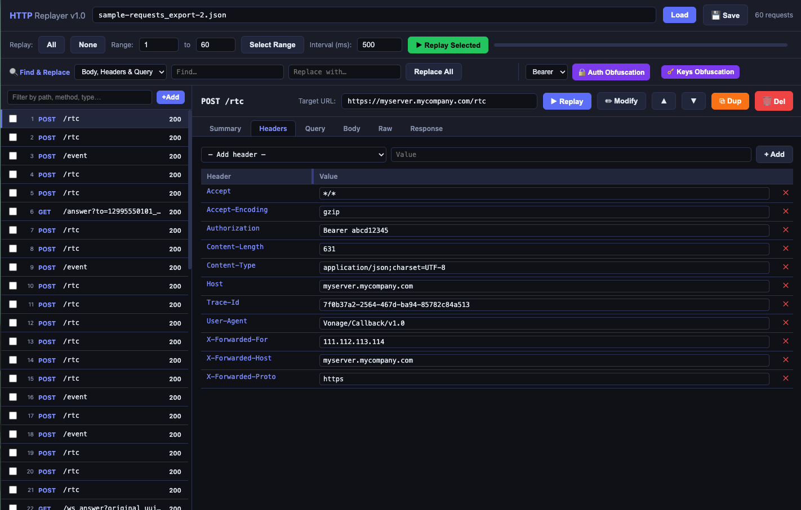
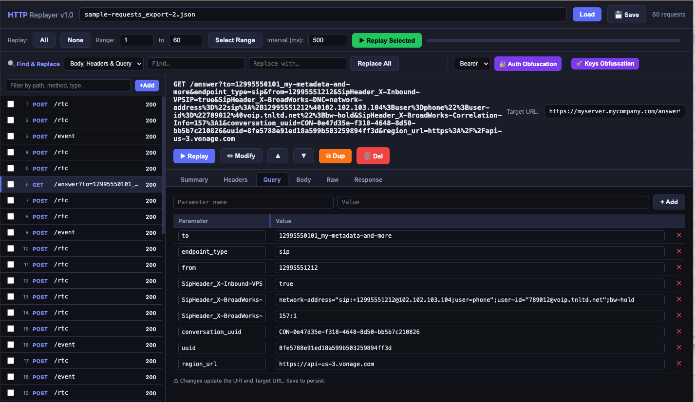
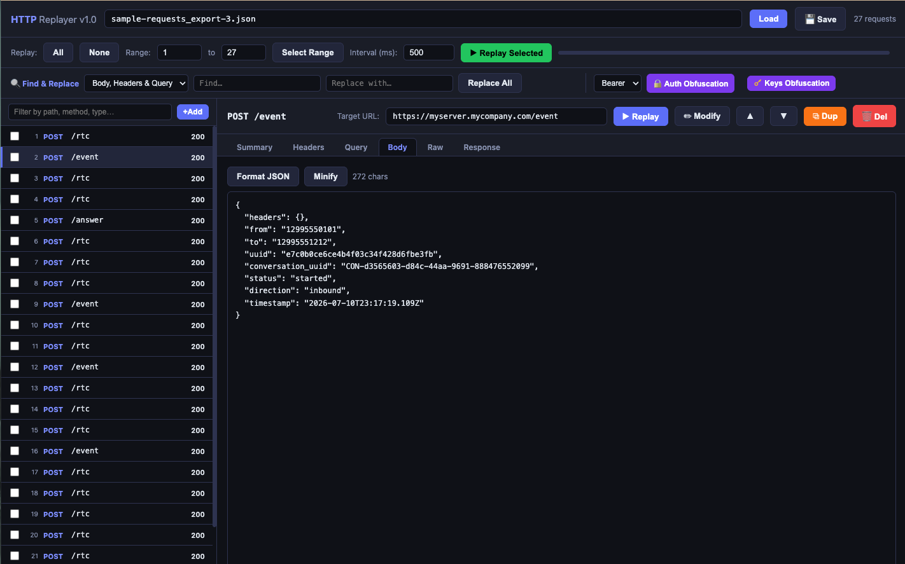

# HTTP Requests Replayer

## What is it?

This tool allows you to replay HTTP requests to server applications and hosts.

You may update an existing list of requests by adding/removing/changing HTTP requests, methods, headers, query parameters, body content, and their values, load and save sets of HTTP requests.

## Set up the application

Have Node.js installed on your system, this application has been tested with Node.js version 22.16<br>

Install node modules with the command:<br>
 ```bash
npm install
```

Launch the server application with the following command:<br>
```bash
node http-requests-replay.cjs 
```

Default local (not public!) `port` of this server application is: 3000.

## Sample sets of HTTP requests to replay

In this version 1, the attached sample sets of HTTP requests were derived from using ngrok and exporting the logged HTTP requests to a file using the command
 ```bash
curl -s http://localhost:4040/api/requests/http | jq '.' > requests_export.json
```

Attached sample HTTP Requests sets are:<br>
sample-requests_export.json<br>
sample-requests_export-2.json<br>
sample-requests_export-3.json<br>

Note: Those requests sets are provided just as examples and may not reflect actual requests chronological order.

For your own usage, you do not need to have or use ngrok, as you may load and update one of these sample sets then add/delete/change HTTP requests and inner arguments.

Of course if you use ngrok, you may export logged HTTP requests and use that set for replay. Remember you may need to manually re-order the requests for correct chronological sequence, see following notes.

Notes:<br>
- In an ngrok HTTP requests export to a file, oldest HTTP events are at the end of the file, most recent ones are at the beginning of the file, i.e. they are in reverse chronological order. With this tool, when saving into a file, it keeps that reverse chronological order.<br>
- When exporting from ngrok, unfortunately the (reverse) order of events in the export file does not necessarily match the order of events as shown on the web ngrok page (at http://127.0.0.1:4040/inspect/http), so you may have to manually change the order of events (using up and down arrows), and the new sequence order will be kept when saving to same or a new file.

## Usage

Open http://localhost:3000.


Enter the full path to your ngrok log JSON file and click Load.


Click any request to inspect Summary / Headers / Params / Body / Raw / Response.

Set the Target URL (auto-detected from Host header).

▶ Replay a single request, or ✏ Modify to edit headers/body first.

Features

| Feature | Description |
| ------------------ | ------------------- |
| Inline edit     | Edit header, query parameter, body content; ✕ button removes individual parameters |
| Query tab | Parses the URI into key/value rows; add, edit, or remove params; URI and Target URL sync live |
| Add/remove headers | Dropdown of standard headers (Accept, Authorization, Content-Type, etc.) + "Custom…" option to type any name; ✕ to delete |
| Content-Length auto-update | Recalculated in bytes whenever body changes (typing, format, minify, or field apply) |
| Find & Replace | Replace any value across body/headers/query, or in paths, across all requests at once |
| Authentication Obfuscation | Replace any Bearer/Basic/Digest arguments across all requests at once |
| Keys Obfuscation | Replace any Headers arguments which names contain the substing key or token across all requests at once |
| Delete request | Removes the selected request with confirmation; list renumbers automatically |
| Duplicate request | Clones the selected request and inserts it immediately after |
| Add new request | Adds a new HTTP request, sets default HTTP headers copied from first request and sets a sample body |
| Change request order | Using the arrows, move up or down in order the selected request |
| Replay all / range | Checkboxes + range picker + "All" selector |
| Adjustable delay  | ms delay between bulk replays |
| Stop | Abort a bulk replay mid-run |
| Filter | Search by path, method, or body content |
| Status indicators | Green = replayed OK, red = error, ✎ = modified |

## Sample UI screen contents

Headers tab



Query tab



Body tab




## Warning

Be careful when sharing your ngrok or other application-generated HTTP request files, as they may contain sensitive credentials, keys, or token information.


